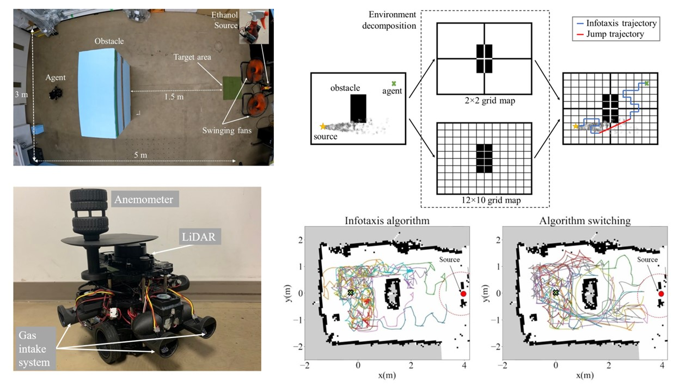
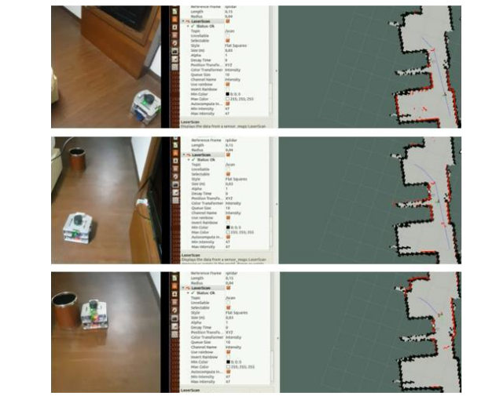
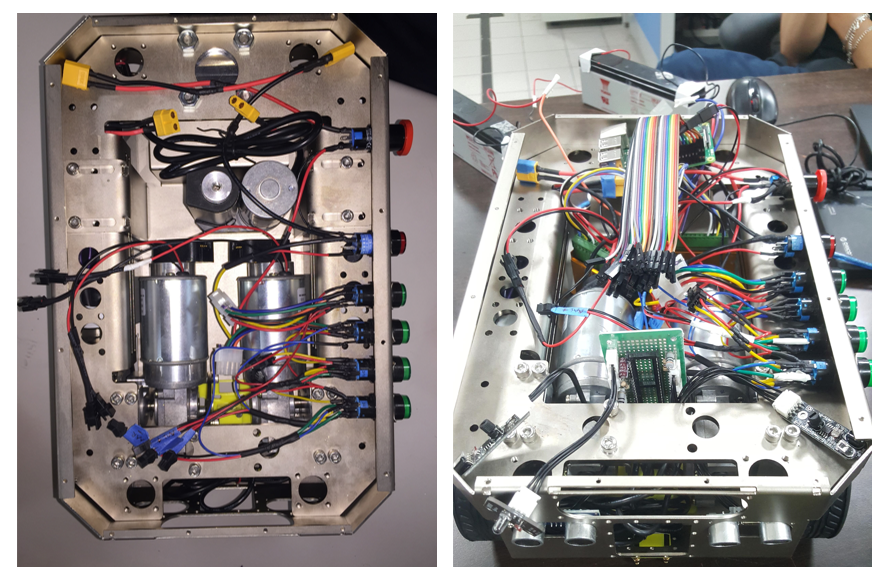
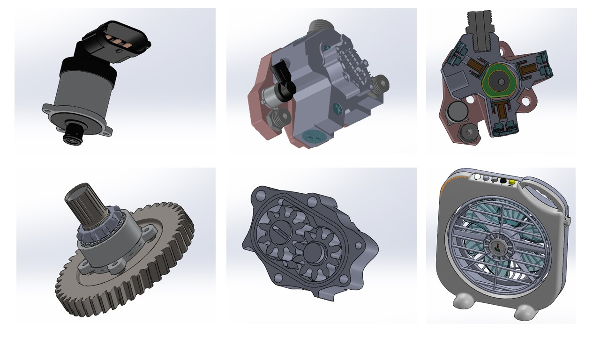

# Works and Publications 
---

## Odor Source Localization in Obstacle Regions Using Switching Planning Algorithms with a Switching Framework

My published research article in [***Sensors***](https://www.mdpi.com/1424-8220/23/3/1140) (January, 2022).

---
##  Designing intelligent autonomous robot using the SLAM algorithm, RRT* algorithm, and Fuzzy-PID techniques.

My published research article in [***Acta Polytechnica Hungarica***](http://acta.uni-obuda.hu/Mac_Lin_Huan_Nhat_Hoang_Hai_113.pdf) (January, 2022).

I used RRT* algorithm to built a path planning ROS package for a customized mobile robot. 

 

 

---
##  Navigation of Automatic Guided Vehicles (AGV) using multiple vision-based algorithms.

I joined the designing an analog control system of AGV in industrial environments using CAN-bus.
This is the work I performed during the internship (March 2019 - May 2019) at National Taiwan University of Science and Technology (NTUST). The project was under the cooperation between the UBIQELIFE Technology Corporation and the Center for Intelligent Robots (NTUST).

 

 

---
## 3D model construction of mechanical and electronic components

 I constructed 3D models of mechanical and electronic components for manufacturing and education purposes by using Computer-Aided Design software (SolidWorks and AUTODESK Inventor). This is the work I performed during the internship (June 2018 - August 2018) at DKS PRODUCTION AND TRADING Co., Ltd, Vietnam. 

 

 
---

© 2022 Nhat Luong.
