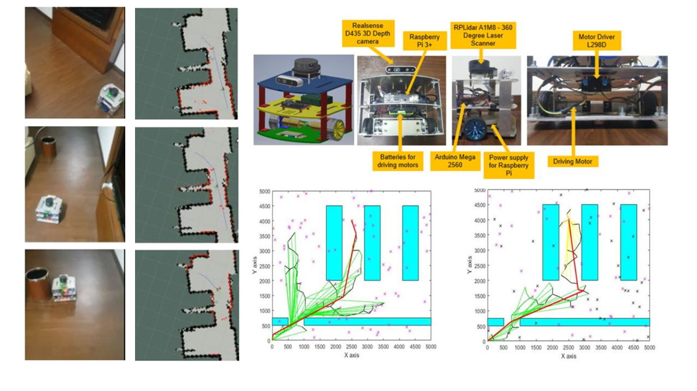

# Works and Publications 
---

## Odor Source Localization in Obstacle Regions Using Switching Planning Algorithms with a Switching Framework

My published research article in [***Sensors***](https://www.mdpi.com/1424-8220/23/3/1140) (January, 2022).

---
##  Designing intelligent autonomous robot using the SLAM algorithm, RRT* algorithm, and Fuzzy-PID techniques.

My published research article in [***Acta Polytechnica Hungarica***](http://acta.uni-obuda.hu/Mac_Lin_Huan_Nhat_Hoang_Hai_113.pdf) (January, 2022).

I successfully applied my expertise in simultaneous localization and mapping (SLAM) and RRT* path planning algorithm to enable a mobile robot to efficiently navigate its surroundings by accurately defining its environment and determining its optimal path. 

 

 

---
##  Navigation of Automatic Guided Vehicles (AGV) using multiple vision-based algorithms.

During my internship at National Taiwan University of Science and Technology (NTUST) in March - May 2019, I was part of the team responsible for designing an analog control system for an Automated Guided Vehicle (AGV) that could operate efficiently in industrial environments. Using CAN-bus technology, we were able to create a system that allowed for seamless communication between the AGV and its surrounding environment. This project was completed in collaboration with the Center for Intelligent Robots (NTUST) and UBIQELIFE Technology Corporation.

 

 

---
## 3D model construction of mechanical and electronic components

 During my internship at DKS Production and Trading Co., Ltd in Vietnam from June to August 2018, I was responsible for creating 3D models of mechanical and electronic components using Computer-Aided Design software such as SolidWorks and AUTODESK Inventor. These models were used for both manufacturing and educational purposes, and my work helped to streamline the production process and improve overall efficiency. 

 

 
---

© 2022 Nhat Luong.
